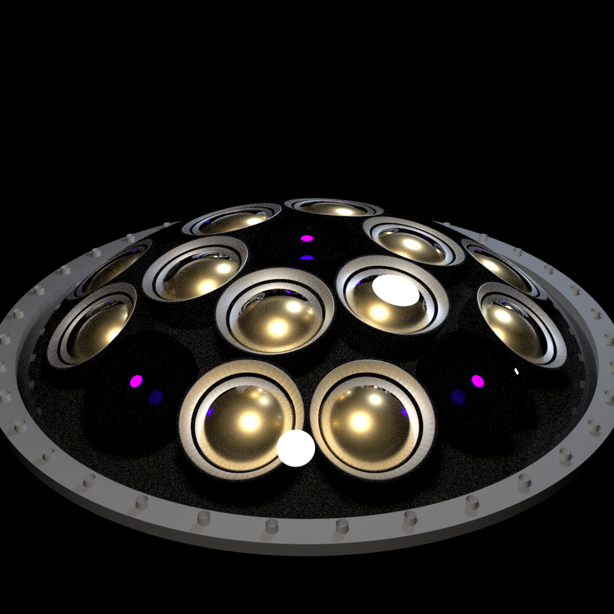

# Detector Component Models

This directory contains the standalone detector-component models used by the Hyper-K photogrammetry renderer.

The main purpose of keeping these models separate is to ensure that component geometry is defined once, tested independently, and then imported into the full detector renderer.

Current standalone models include:

- Far Detector mPMT
- LED-FEB
- Hamamatsu R12860 20-inch PMT
- PMT support matrix mesh

---

## Far Detector mPMT



Defined in:

```text
fd_mpmt_model.py
```

The Far Detector mPMT contains:

- 19 3-inch PMT positions in a 1-6-12 layout
- PMT support matrix
- acrylic dome approximation
- LED-FEB replacement positions
- detector-facing coordinate convention
- standalone PBRT scene generation

### PMT Layout

The PMT positions are based on the Far Detector mPMT geometry:

```text
PMT rows                : 1, 6, 12
central PMT position    : 224.678 mm from original baseplate reference
row transverse radii   : 0, 109.487, 199.909 mm
row axial offsets       : 0, -20.8, -75.543 mm
row tilts               : 0, 0.297, 0.593 rad
baseplate diameter      : 590 mm
3-inch PMT radius       : 38.1 mm
```

The outer PMTs tilt radially outward.

### Coordinate Convention

The mPMT model has been rebased so that:

```text
local z = 0
```

corresponds to the rear of the PMT support matrix / module mounting reference plane.

The local `+z` direction points from the detector wall into the detector volume.

This convention is important for photogrammetry because detector-level mPMT coordinates can be associated with a single consistent reference point.

### PMT Support Matrix

The support matrix is imported from:

```text
matrix_pbrt.ply
```

The currently tuned transform is:

```text
matrix scale x = 1.370625
matrix scale y = 1.370625
matrix scale z = 1.485
matrix z offset = -0.150 m
matrix rotation = 30 degrees
```

The complete module is shifted as a rigid body so that the rear of the support matrix lies at:

```text
z = 0
```

This preserves the relative PMT-to-matrix geometry.

### LED-mPMTs

LED-mPMTs replace five normal PMT positions with LED-FEB modules:

- one central position
- four positions on the outer PMT row
- outer positions separated by 90 degrees

These five locations form the cross-like pattern used for photogrammetry feature detection.

The LED-FEB faces are shifted forward by:

```text
0.040 m
```

along their individual PMT-slot normals to prevent them from being obscured by the support matrix.

### Standalone Render

Example:

```bash
python fd_mpmt_model.py \
    --view angle \
    --pixelsamples 2048 \
    --maxdepth 16 \
    --led-mpmt
```

Then render the generated scene with PBRT:

```bash
pbrt single_fd_mpmt.pbrt
```

Other views can be generated with:

```bash
--view front
--view angle
--view side
```

---

## LED-FEB


Defined in:

```text
fd_led_feb_model.py
```

The LED-FEB model represents the LED modules installed in LED-mPMTs.

The model includes geometry for the LED board and optical components used in the lighting studies.

Current LED types include:

```text
365 nm UV
405 nm violet
470 nm blue
```

The model includes both diffuse and collimated LED components.

For photogrammetry studies, the detailed optical source can be replaced by a simplified emissive target while retaining the same known target position.

This allows the lighting model and the photogrammetry feature model to be treated separately.

---

## Photogrammetry Target

For triangulation datasets, the physical LED optical stack can be replaced by a simplified one-sided Lambertian emissive disk.

This is used because the full diffuser/acrylic/gel system introduces reflections and scattering that are unnecessary when the main objective is feature detection and 3D reconstruction.

The simplified target provides:

- a clearly defined 3D feature position
- one-sided emission
- reduced optical clutter
- a clean target for feature detection

The target position relative to the mPMT reference plane must remain known because this transform is required when converting a reconstructed feature position back into a reconstructed mPMT position.

---

## R12860 20-inch PMT


Defined in:

```text
r12860_model.py
```

The model represents the front geometry of the Hamamatsu R12860 20-inch PMT.

The front-window geometry is based on available Hamamatsu dimensions.

Current geometry includes:

```text
effective photocathode diameter : 460 mm minimum
maximum bulb diameter           : 508 mm
front curvature radius          : 325 mm
```

The current model focuses primarily on the visible front section of the PMT.

Some optical properties remain simplified, including the internal photocathode representation.

---

## Support Matrix Mesh

The FD mPMT support matrix is stored as:

```text
matrix_pbrt.ply
```

The source mesh is transformed inside `fd_mpmt_model.py` before being written to the PBRT scene.

The matrix is kept as an external mesh rather than reproducing the geometry using PBRT primitives.

This allows the detailed matrix shape to be retained while the surrounding module geometry remains parametric.

---

## Images

Standalone PBRT renders should be stored under:

```text
models/images/
```

Recommended images are:

```text
fd_mpmt_angle.png
fd_mpmt_front.png
led_feb.png
r12860.png
```

These images are intended to provide a quick visual reference for the geometry without requiring the full detector to be rendered.

---

## Model Development

Standalone models should be tested independently before changes are integrated into the full Hyper-K renderer.

The intended workflow is:

```text
modify standalone model
        ↓
generate standalone PBRT scene
        ↓
render and inspect
        ↓
verify coordinate convention
        ↓
integrate into full detector renderer
```

This helps prevent geometry changes from affecting the full detector before they have been validated.

---

## Geometry and Optical Approximations

Not every component currently has complete engineering-level geometry.

Current approximations include:

- acrylic dome dimensions
- acrylic/gel optical properties
- simplified PMT photocathodes
- simplified PMT internal geometry
- fitted support-matrix scaling
- simplified photogrammetry targets

Where possible, measured or documented dimensions are kept separate from visual or optical approximations.

The most important requirement for the photogrammetry pipeline is that the relative geometry and coordinate transforms remain consistent between:

```text
component models
full detector renderer
feature projection
ID matching
triangulation
```
## Materials and Optical Interfaces

The standalone component models include simplified PBRT materials so that the
geometry can be inspected under approximately realistic optical conditions.

These materials are primarily intended for raytracing and photogrammetry
development rather than as a complete optical model of every detector
component.

### FD mPMT

The FD mPMT currently uses:

| Component | PBRT representation |
|---|---|
| Support / metal hardware | conductor |
| PMT photocathode | gold-like conductor approximation |
| Support matrix | very dark diffuse material |
| Acrylic dome | dielectric |
| Optical gel | dielectric |
| PMT glass | dielectric |
| PMT interior | vacuum / dielectric interface |

The main refractive indices currently used are:

```text
air      : 1.00
water    : 1.33
acrylic  : 1.49
gel      : 1.46
glass    : 1.50
vacuum   : 1.00
```

Interfaces are defined explicitly between adjacent materials, including:

```text
water → acrylic
air → acrylic
acrylic → gel
acrylic → air
gel → glass
air → glass
glass → vacuum
```

The metallic PMT photocathode is currently an approximation and should not be
interpreted as a full wavelength-dependent PMT response model.

### LED-FEB

The LED-FEB model contains its own optical and structural materials.

These include:

- dark board / housing materials
- acrylic components
- PTFE diffuser components
- optical gel where applicable
- wavelength-dependent LED emission models

The LED source geometry and the surrounding optical stack can be used for
lighting studies.

For photogrammetry-only studies, the detailed LED optical model may instead
be replaced by a simplified emissive target so that the feature location is
clearly defined.

### R12860 20-inch PMT

The R12860 model contains:

- dielectric glass
- vacuum interior
- simplified reflective photocathode
- surrounding water interface

The current model concentrates on reproducing the visible front geometry and
the principal refractive interfaces.

The internal PMT optical response remains simplified.

## Material Approximations

Several material properties are currently approximations.

In particular:

- photocathodes are represented using reflective conductor materials
- acrylic and gel absorption are simplified
- detailed wavelength-dependent glass properties are not included
- surface roughness values are approximate
- support-matrix material is primarily chosen to reproduce its dark appearance
- LED optical properties are simplified relative to the complete physical
  device

These assumptions should be considered when interpreting absolute light
levels or detailed reflection behaviour.

For photogrammetry studies, the most important requirement is that the
geometry, refractive interfaces and feature positions remain consistent
between the standalone models and the full detector renderer.
