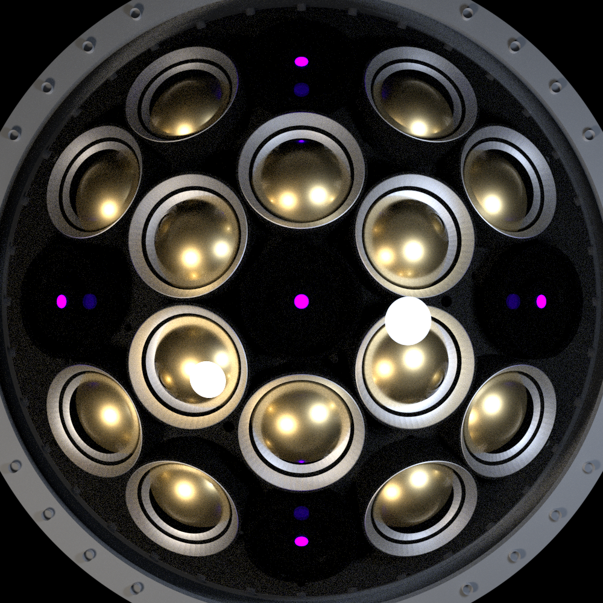
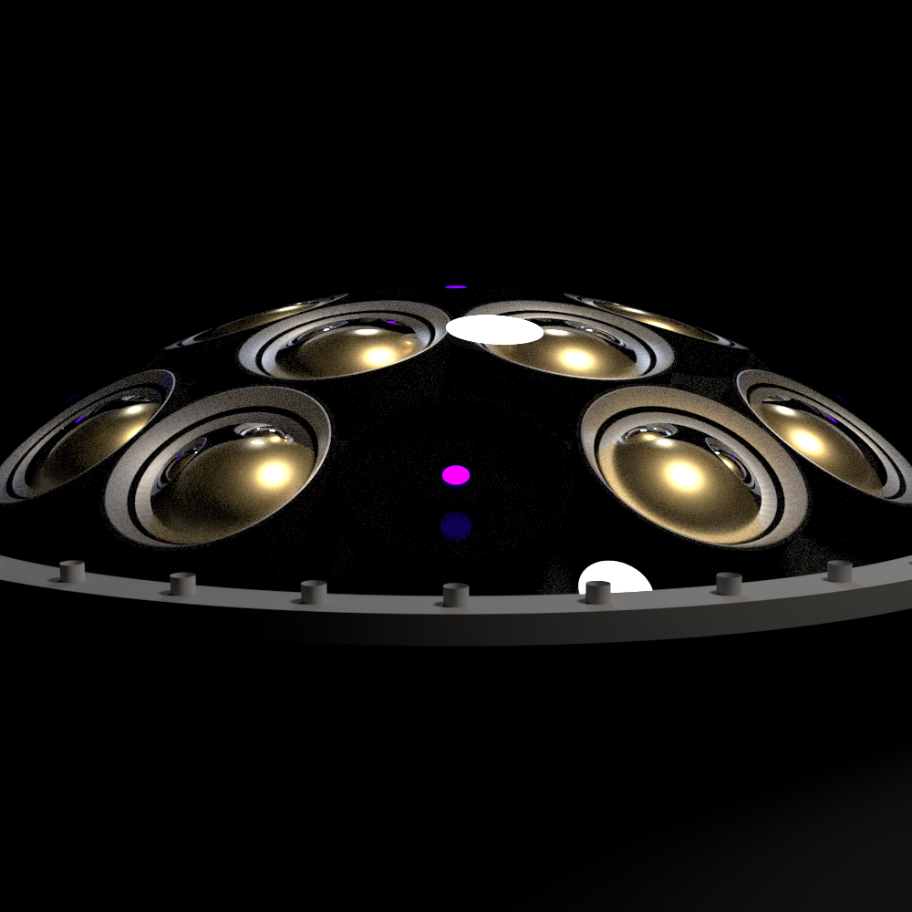

# Model Render Images

This directory contains standalone PBRT renders of the detector component models.

The images are intended as a quick visual reference for the geometry used by the full Hyper-K photogrammetry renderer.

For each component, three standard views are provided:

```text
front
side
angle
```

This makes it easier to inspect the geometry, orientation, component spacing, and optical surfaces without rendering the full detector.

---

## Far Detector mPMT

### Front



### Side



### Angle


The FD mPMT render shows:

- 19 3-inch PMT positions
- 1-6-12 PMT layout
- PMT support matrix
- acrylic dome
- LED-FEB replacement positions when enabled

The local module `+z` direction points outward through the PMTs and into the detector volume.

---

## LED-FEB

### Front


### Side


### Angle


The LED-FEB model contains the geometry used for the LED modules installed in LED-mPMTs.

The standalone model is useful for checking:

- board geometry
- diffuser positions
- collimated LED positions
- optical layers
- LED orientation

For photogrammetry-only renders, the full optical source may be replaced by a simplified emissive target.

---

## R12860 20-inch PMT

### Front


### Side


### Angle


The R12860 model represents the visible front geometry of the 20-inch PMTs used throughout the detector.

The standalone renders are useful for checking:

- front-window curvature
- PMT scale
- photocathode geometry
- placement convention
- orientation relative to the detector wall

---

## Naming Convention

Images should follow:

```text
<component>_<view>.png
```

For example:

```text
fd_mpmt_front.png
fd_mpmt_side.png
fd_mpmt_angle.png

led_feb_front.png
led_feb_side.png
led_feb_angle.png

r12860_front.png
r12860_side.png
r12860_angle.png
```

Keeping the naming consistent makes the images easy to reference from the main `models/README.md`.

---

## Purpose

These renders are primarily for geometry validation and documentation.

The recommended workflow is:

```text
modify model
    ↓
render front / side / angle
    ↓
inspect geometry
    ↓
confirm coordinate convention
    ↓
integrate into full detector renderer
```

These images are not intended to represent final detector photogrammetry datasets. They are standalone reference renders of the component models.
